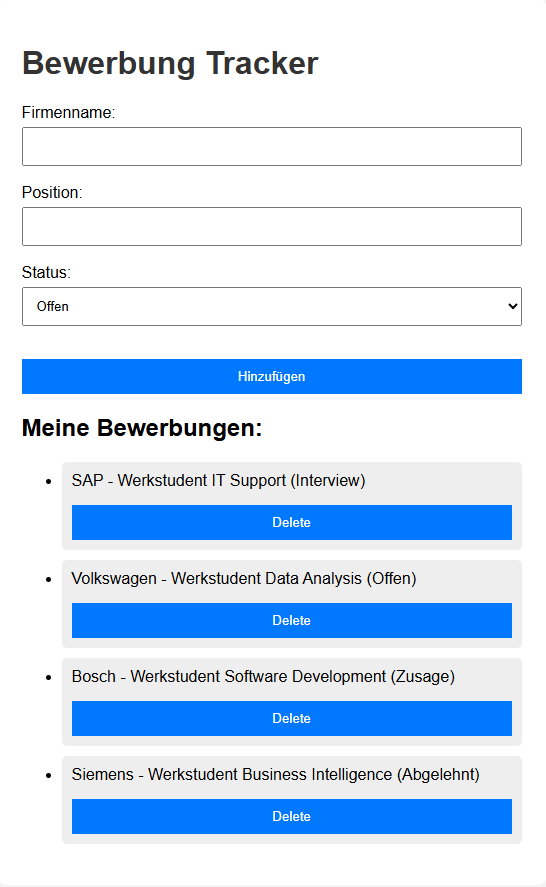

# Bewerbung Tracker App

A simple web application built with Python and Flask to manage job applications.

---

## Features

- Add job applications (company, position, status)
- View all applications in a list
- Delete applications
- Store data using SQLite database

---

## Technologies Used

- Python
- Flask
- SQLite
- HTML/CSS
- Git & GitHub

---

## Purpose

This project was built as a learning project to understand:
- Web development
- Databases
- Backend basics
- CRUD operations

---

## What I Learned

- Flask routing
- Working with SQLite databases
- CRUD functionality
- HTML templates with Jinja2
- GitHub basics

---

## Status

First working version completed.

---

## Screenshot

